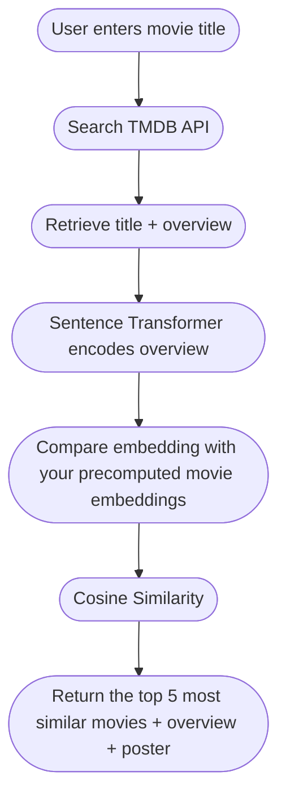

# Foreign Language Film Recommendation System 

Most movie recommendation systems are designed to recommend similar movies regardless of language. While it's possible to filter these recommendations to only show foreign-language films, discovering international cinema isn't usually the main goal of the recommender.

As someone who loves international films, I wanted to build a recommendation system where foreign-language films are the focus rather than an afterthought. Instead of simply recommending similar movies, the aim is to help users discover foreign films that share similar themes, genres and storytelling elements with English-language movies they already enjoy, making it easier to explore cinema from different cultures.

This project is a content-based movie recommender built with Sentence Transformers, Cosine Similarity, and the TMDB API, and deployed as an interactive Streamlit application.

Live App: https://foreign-film-recs.streamlit.app/

before we start these are my own top foreign film recs <3 
* Anatomy of a Fall (2023)
* Potrait of a Lady on Fire (2019)
* Jab We Met (2007)
* Yi Yi (2000)
* Chungking Express (1994)

## Table of Contents
- Project Overview
- Recommendation Pipeline
- Model Selection
- Dataset
- Local Installation
- Areas for Improvement
- Tech Stack

## Project Overview
Users can search for any movie available on TMDB, and the application recommends the Top 5 most semantically similar foreign-language films.
Unlike keyword-based recommenders, this project compares the meaning of movie overviews rather than simply matching overlapping words.

## Recommendation Pipeline

##Model Selection

This project began by experimenting with TF-IDF as a baseline approach.

The initial workflow was:
* Convert movie overviews into TF-IDF vectors
* Calculate cosine similarity
* Recommend the five most similar films
  
While TF-IDF performed reasonably well, it relied heavily on shared vocabulary. Movies with similar wording were often recommended even when their stories or themes were unrelated.I then looked into two alternatives: Word2Vec and Sentence Transformers.

Although Word2Vec generates better word embeddings than TF-IDF, it learns representations for individual words rather than the meaning of an entire movie overview. Since my goal was to compare complete movie descriptions instead of just matching important words, I felt that Sentence Transformers were a better fit for this project.

I therefore used the all-MiniLM-L6-v2 Sentence Transformer model to generate embeddings for each movie overview. I then calculated the cosine similarity between these embeddings to identify the most semantically similar movies.

From my testing, the recommendations generated using Sentence Transformers aligned much better with the themes, storytelling and overall narrative of the searched movie, rather than simply recommending movies with similar wording in their overviews.

## Dataset Used

This project uses the Top 10,000 TMDB Highest Rated Movies dataset from Kaggle.
https://www.kaggle.com/datasets/rosemeenshaikh/top-10000-tmdbs-highest-rated-movies

I chose this dataset because it was already well cleaned,contained detailed movie overviews,includes original language information and contains highly rated films from many countries. One limitation is that the dataset was last updated in 2024.

To ensure users can still search for newly released movies, I integrated the TMDB API into the search workflow. This allows users to search for virtually any movie currently listed on TMDB, while recommendations are generated using the precomputed embedding database.

## Local Installation:
1. Clone the repository
2. Install requirements
3. Set up TMDB API Key: create env file
4. Run "streamlit run app.py" in the terminal

## Areas for Improvement

### Better Horror Recommendations
The recommender is best at recommending thriller/action films and the worst at giving suitable recommendations for horror films. This could be attributed to the fact that horror films have a relatively benign overview that doesnt give away the plot of the movie. 
However this is a data limitation

Potential improvements include:
- incorporating genres and keywords into the embedding ( there's no in depth plot summary just a simple overview)
- incorporating director information (most horror directors usually stick to directing horror)
- fine-tuning a transformer model specifically on movie metadata

## Tech Stack 
* **Language**: Python
* **Natural Language Processing**: Sentence Transformers (all-MiniLM-L6-v2)
* **Machine Learning**: Scikit-learn (Cosine Similarity)
* **API Integration**: TMDB API
* **Frontend**: Streamlit
* **Data Preprocessing**: Pandas/Numpy
  

